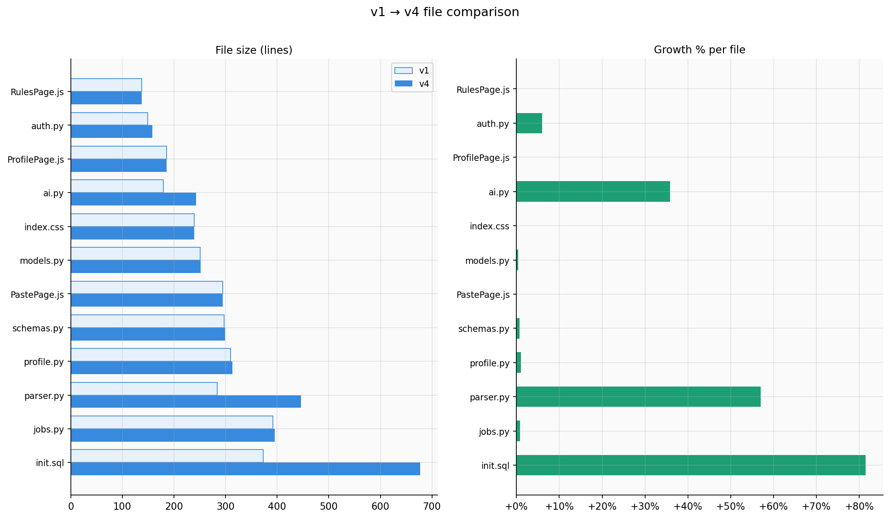

# version-drift

A command-line tool to quantify and visualize how a software repository evolved across versions. Point it at a directory of versioned subdirectories and it produces charts, CSVs, schema diffs, and (optionally) AI-written narratives describing what changed and why it matters.

> **Status: vibe coded, not yet formally tested.**
> This tool was built with AI assistance as part of an experiment in rapid development. It works on the demo dataset it was built against, but has not been tested across a wide range of real-world repositories. Use with appropriate skepticism, and please open an issue if something breaks.

---

## Background

This is one piece of a larger project — also vibe coded — where I'm using it to measure and understand the *amount* of change between successive versions of that project. Think of it as a retrospective lens on your own development velocity: how fast did the codebase grow? When did the schema stabilize? Which files absorbed the most churn?

---

## Sample output



*Per-file line count and growth percentage between two versions.*

---


## Example AI narrative

> *(Generated by Claude Sonnet via the Anthropic API — v1 to v4 comparison)*
>
> From v1 to v4, the repository underwent substantial growth, nearly doubling in lines of code (+87.9%) while adding 16 new files with no removals — a signal of aggressive feature expansion rather than refactoring. The most structurally significant additions are a new versioned API module layer with resource-oriented files for jobs, profiles, admin, and export, suggesting the application transitioned from a loosely organized backend toward a proper REST API architecture.
>
> The introduction of API key management alongside new request logging database tables indicates the system now supports authenticated programmatic access, likely enabling third-party integrations or a public API tier. A cluster of AI-related schema additions — call logs, extracted requirements, feedback signals, versioned prompts, and fit score snapshots — reveals the emergence of an AI-driven analysis feature complete with audit trails and feedback loops for model improvement.
>
> Rounding out the release, rate limiting infrastructure and a data export pipeline suggest the system is hardening for production use with observability and recruiter-facing reporting controls.
---

## What it does

- Scans versioned subdirectories (`v1.0/`, `v2.0/`, `release-3.1/`, etc.) and extracts file counts, lines of code, and file type breakdown
- Parses SQL schema files to detect table and column additions, removals, and modifications
- Computes a weighted **schema change score** across versions
- Generates charts (LoC over time, file count, extension breakdown, schema delta scores, per-file comparison)
- Exports CSVs and plain-text reports per comparison
- Optionally calls the Anthropic API to write a plain-English narrative of what changed — "From v1 to v3 we saw..."
- Saves all outputs into named directories (`v1.0_to_v3.0/`, `overview/`, etc.)
- Report filenames reflect whether AI was used: `v1_to_v4_ai.txt` or `v1_to_v4_no_ai.txt`

---

## Requirements

```
pip install -r requirements.txt
```

Python 3.10+ is required (uses `str | None` union syntax).

---

## Usage

```bash
# Discover versioned subdirectories
python version_drift.py scan ./my_project

# Print a summary table to the terminal
python version_drift.py show ./my_project

# Generate overview charts + CSV across all versions
python version_drift.py overview ./my_project

# Compare two specific versions — saves to v2.0_to_v4.0/
python version_drift.py compare ./my_project 2.0 4.0

# Run everything: overview + all consecutive comparisons
python version_drift.py full ./my_project

# Custom output location
python version_drift.py compare ./my_project 1.0 5.0 --out ./reports
```

### Output structure

```
repo_analysis/
  overview/
    loc_over_time.png
    file_count.png
    ext_breakdown.png
    schema_scores.png
    overview.csv
    report.txt
  v1.0_to_v2.0/
    file_comparison.png
    file_changes.csv
    v1.0_to_v2.0_ai.txt        ← with API key
    v1.0_to_v2.0_no_ai.txt     ← without
  v2.0_to_v3.0/
    ...
```

---

## AI narratives

Set your Anthropic API key and the tool will generate plain-English summaries of each comparison. Without a key, everything else still works — the narrative section in reports will just show a placeholder.

If you run a comparison again after adding a key, the tool will detect the existing report and ask before regenerating. Failed API calls save as `_ai_failed.txt` so they're easy to spot and retry.

**Windows (PowerShell, current session):**
```powershell
$env:ANTHROPIC_API_KEY = "sk-ant-..."
```

**Windows (permanent, user account):**
```powershell
[System.Environment]::SetEnvironmentVariable("ANTHROPIC_API_KEY", "sk-ant-...", "User")
```

**macOS / Linux:**
```bash
export ANTHROPIC_API_KEY="sk-ant-..."
```

Or pass it directly:
```bash
python version_drift.py full ./my_project --api-key sk-ant-...
```

---

## Version directory detection

The tool auto-detects version numbers in directory names. All of these work:

| Directory name  | Detected version |
|-----------------|-----------------|
| `v1.0`          | 1.0             |
| `v2.3.1`        | 2.3.1           |
| `release-3.0`   | 3.0             |
| `version_4`     | 4               |
| `jobtracker_v2` | 2               |
| `1_0`           | 1.0             |

---

## Schema detection

Parses `CREATE TABLE` statements from any `.sql` files found in each version directory. Handles quoted identifiers, `IF NOT EXISTS`, and skips constraint/index lines. Does not yet support migration files or ORM model definitions — PRs welcome.

---

## License

MIT. See [LICENSE](LICENSE).

This is free to use, fork, and adapt. Attribution appreciated but not required.

---

## Contributing

Issues and PRs welcome, especially around:
- Supporting more SQL dialects and ORM formats
- Git-native mode (read directly from a repo's commit history rather than snapshot directories)
- More chart types
- Windows path edge cases
